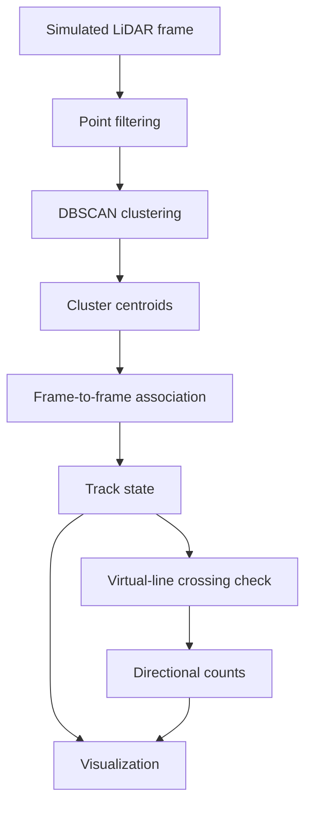

# LiDAR-Based Crosswalk Counter

A camera-free prototype for clustering, tracking, and counting moving objects in simulated 2D LiDAR frames.

The project uses DBSCAN to group nearby points, associates cluster centroids across frames, and records when a tracked object crosses a configurable virtual line. A Matplotlib animation and Streamlit dashboard display the simulated point cloud, active tracks, and directional counts.

> **Scope:** The current repository demonstrates the algorithm with simulated LiDAR data. It has not been validated with a roadside sensor or evaluated for traffic-control or public-safety decisions.

## Motivation

Camera-based pedestrian counting provides rich visual information but also records identifiable imagery. A 2D LiDAR sensor offers a different input representation: a sequence of distance measurements rather than conventional images.

I built this project to understand the main stages of a simple LiDAR counting pipeline:

- Represent a scene as 2D point-cloud frames.
- Separate nearby points into candidate objects.
- Associate those candidates across time.
- Detect virtual-line crossings.
- Maintain direction-specific counts.
- Visualize intermediate tracking state.

The project is an algorithmic prototype rather than a complete pedestrian-detection system.

## Current Capabilities

- Generates simulated 2D LiDAR frames
- Groups nearby points using DBSCAN
- Represents each cluster using its centroid
- Associates centroids between consecutive frames
- Assigns temporary track identifiers
- Detects crossings of a virtual line
- Counts movement in both directions
- Displays a Matplotlib animation
- Provides a Streamlit dashboard

## Pipeline



## How It Works

### 1. Simulated LiDAR Frames

The offline demo generates sequences of 2D points that represent moving object-like clusters and background measurements.

Simulation makes the pipeline reproducible and easy to inspect, but simulated clusters do not reproduce every property of real LiDAR measurements, such as occlusion, reflection, weather, sensor noise, and irregular scan timing.

### 2. DBSCAN Clustering

DBSCAN groups points according to neighborhood distance and minimum-density parameters.

It is useful here because:

- The number of clusters does not need to be specified in advance.
- Sparse points can be marked as noise.
- Clusters can have non-spherical shapes.

Its output depends strongly on `eps`, `min_samples`, point density, and sensor distance. One physical object may be split into several clusters, while nearby objects may be merged into one cluster.

### 3. Centroid Tracking

Each detected cluster is represented by its centroid. The tracker associates current centroids with previous tracks using spatial distance and assigns identifiers to matched objects.

These identifiers are temporary tracking labels. They should not be interpreted as persistent identities of real people.

Simple centroid association works when objects are separated and motion between frames is small. It can produce ID switches when objects cross, become occluded, move quickly, or appear close together.

### 4. Virtual-Line Counting

The application defines a line in the 2D coordinate space. A track is counted when its observed position moves from one side of the line to the other.

The direction is derived from the previous and current side of the track:

- Left to right
- Right to left

Reliable line-crossing logic normally requires track history, minimum track age, and protection against counting the same object repeatedly when its estimated position fluctuates near the line.

## What the System Detects

The current pipeline detects and tracks **LiDAR point clusters that satisfy the configured DBSCAN parameters**.

It does not contain a trained pedestrian classifier. Calling every cluster a pedestrian is an assumption made by the simulation, not a classification result.

Real deployments would need additional shape, motion, size, or learned features to distinguish pedestrians from bicycles, carts, vehicles, vegetation, and sensor artifacts.

## Camera-Free Data Collection

The project does not use conventional camera images. This can reduce the amount of directly identifiable visual data collected by the application.

Camera-free does not automatically mean privacy-guaranteed. Depending on sensor resolution, retention, and downstream processing, movement trajectories may still contain sensitive information. A deployed system would need data-retention rules, access controls, and a privacy review.

## Technology

| Area | Technology |
| --- | --- |
| Language | Python |
| Numerical processing | NumPy |
| Clustering | scikit-learn DBSCAN |
| Visualization | Matplotlib |
| Dashboard | Streamlit |

## Project Structure

```text
LiDAR-Based-Pedestrian-Counter-for-Crosswalks/
├── src/                  # Simulation, clustering, tracking, and counting logic
├── dashboard.py          # Streamlit dashboard
├── requirement.txt       # Python dependencies
└── README.md
```

Generated environments and operating-system files should not be committed. Remove `venv/` and `.DS_Store` from version control and add them to `.gitignore`.

## Setup

Clone the repository:

```bash
git clone https://github.com/dhyanagni2001-commits/LiDAR-Based-Pedestrian-Counter-for-Crosswalks.git
cd LiDAR-Based-Pedestrian-Counter-for-Crosswalks
```

Create and activate a virtual environment:

```bash
python3 -m venv .venv
source .venv/bin/activate
```

Install the dependencies:

```bash
python -m pip install -r requirement.txt
```

The dependency file is currently named `requirement.txt`. Renaming it to the conventional `requirements.txt` would make the repository easier to recognize and use.

## Run the Offline Demo

```bash
python -m src.main_offline_demo
```

The demo displays:

- Simulated LiDAR points
- DBSCAN clusters
- Track identifiers
- The virtual counting line
- Directional crossing totals

## Run the Streamlit Dashboard

```bash
streamlit run dashboard.py
```

The dashboard displays the simulated point cloud and the counts produced by the current tracking session.

## Parameters That Affect Results

The most important configuration values include:

| Parameter | Effect |
| --- | --- |
| DBSCAN `eps` | Maximum neighborhood distance used to connect points |
| DBSCAN `min_samples` | Minimum local point density required for a cluster |
| Association distance | Maximum movement allowed when matching a track |
| Track timeout | Number of missed frames before removing a track |
| Virtual-line position | Location at which crossings are counted |
| Crossing tolerance | Region used to prevent noise near the line from creating repeated counts |

Parameter names may differ in the implementation. Values should be chosen using the coordinate scale, scan rate, point density, and expected motion of the input data.

## Evaluation Status

The repository currently demonstrates behavior visually using simulated movement. It does not document a labeled evaluation of:

- Cluster detection precision or recall
- Tracking accuracy
- ID-switch frequency
- Missed or repeated crossings
- Direction-classification accuracy
- Processing latency or frame rate
- Performance on real LiDAR recordings

Visual inspection is useful during development, but it is not a substitute for quantitative evaluation.

## Recommended Evaluation

Create a labeled sequence set containing:

- Single-object crossings
- Multiple objects moving in the same direction
- Objects crossing in opposite directions
- Temporary occlusion
- Objects walking near the line without crossing
- Objects stopping on the line
- Closely spaced objects that may merge into one cluster
- Sparse or noisy point clouds
- Missed frames

Report measurements such as:

- Count error: `abs(predicted_count - true_count)`
- Mean absolute counting error across sequences
- Precision and recall for crossing events
- Direction accuracy
- ID switches
- Track fragmentation
- Processing time per frame

## Design Tradeoffs

### DBSCAN

DBSCAN is straightforward and does not require labeled training data. Its fixed density parameters may not work equally well at different distances from a sensor because point density changes with range.

### Centroid Association

Centroid matching is computationally inexpensive and understandable. It does not model velocity, uncertainty, appearance, or long occlusion.

A Kalman filter with global assignment could improve association, while more advanced multi-object tracking would increase implementation complexity.

### Virtual-Line Counting

Line crossing is simple to explain and supports directional counts. It depends on stable tracks and careful handling of jitter near the boundary.

### Simulation

Simulation provides controllable scenarios and known movement paths. Results can look cleaner than real sensor data and should not be used to claim field performance.

### LiDAR Instead of Cameras

LiDAR avoids conventional images and can work across lighting conditions, depending on the sensor. It provides less semantic information, introduces hardware cost, and still requires responsible handling of trajectory data.

## Limitations

- The documented demo uses simulated data.
- Clusters are assumed to represent pedestrians but are not classified as people.
- DBSCAN parameters may not transfer between sensors or environments.
- Centroid association can switch or lose track identifiers.
- Occlusion and closely spaced objects can produce counting errors.
- Line jitter may cause missed or repeated crossing events.
- No quantitative accuracy or runtime benchmark is documented.
- Weather, reflective surfaces, and real sensor noise are not modeled comprehensively.
- The Streamlit dashboard is a demonstration interface rather than a traffic-control system.

## Possible Improvements

- Add a loader for a documented public 2D LiDAR dataset.
- Evaluate the counter using labeled crossing sequences.
- Add track confirmation, timeout, and line-crossing hysteresis.
- Use a Kalman filter to estimate motion.
- Use Hungarian assignment for global track-to-detection matching.
- Add object-shape and motion features for pedestrian-candidate filtering.
- Record processing latency and supported frame rate.
- Add unit tests for clustering, association, and boundary conditions.
- Add continuous integration.
- Remove `venv/` and `.DS_Store` from Git history.

## What I Learned

This project helped me understand how spatial clustering, multi-frame association, stateful tracking, and event counting fit together in a sensor-processing pipeline.

It also demonstrated why a clean simulation is only the beginning of evaluation. A cluster is not automatically a pedestrian, a temporary track ID is not a real identity, and a visually correct animation does not establish counting accuracy on physical sensor data.
